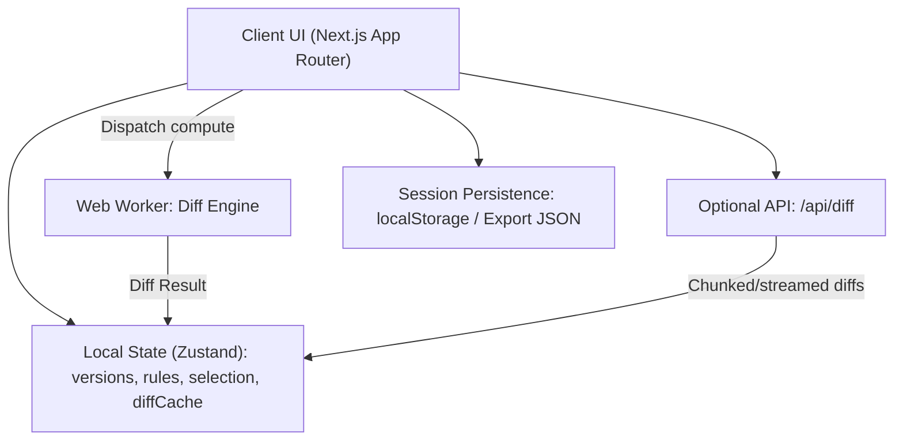

# Design Document

## Overview

This design specifies a Next.js (App Router, TypeScript) web application that ingests an arbitrary number of JSON objects, computes diffs between each pair, and visualizes changes over time with a modern aesthetic and motion powered by Framer Motion. The solution emphasizes:

- Accurate diff semantics for objects, arrays, and primitives
- Timeline scrubbing between adjacent versions and on-demand all-pair comparisons
- High performance via Web Workers and virtualized rendering for large JSONs
- A polished UI inspired by Dribbble/Mobbin with tasteful micro-interactions
- Privacy-first local processing by default, with optional server-side fallback

Key technologies: Next.js App Router (TypeScript), React, framer-motion, Zustand (state), Tailwind CSS (or CSS-in-JS alternative), Web Workers (via Comlink), and a JSON diff engine (jsondiffpatch + custom adapters).


## Architecture

- Client-first processing: JSON parsing, rule transforms, and diff computation run in a Web Worker to keep the UI responsive.
- Optional API route `/api/diff` supports server-side diffing for very large payloads (disabled by default for privacy).
- The UI is composed of modular components: ingestion, timeline, pair matrix, diff tree, rules panel, search, and session controls.
- State is organized around `versions`, `rules`, `selection` (timeline index or pair), and `diffCache` keyed by `(versionAId, versionBId, optionsKey)`.



Rationales:
- Web Worker isolates CPU-heavy diffing, protecting 60 FPS rendering.
- Local-first aligns with privacy and reduces infra needs; server endpoint is a safety valve.
- Diff cache prevents recomputation when scrubbing or revisiting pairs.


## Components and Interfaces

### UI Components

- `UploadPanel`
  - Inputs: paste area, multi-file input, URL fetcher
  - Actions: add versions, set labels/timestamps, reorder
  - Motion: reveal/expand, validation feedback

- `TimelineScrubber`
  - Shows ordered versions with labels/timestamps
  - Drag/scrub playhead; play/pause transitions (Framer Motion)
  - Emits selection change of adjacent pairs

- `PairMatrix`
  - N×N selectable grid of versions to choose any pair for diff
  - Highlights current timeline-adjacent pair

- `DiffTreeView`
  - Virtualized expandable tree of changes (add/delete/modify/unchanged)
  - Color legend, pill badges, and per-node expand/collapse
  - Lazy-render children; search highlighting

- `RulesPanel`
  - Ignore rules by key path / glob / regex
  - Transform rules (normalize, round, sort array, case, custom mapping)
  - Enable/disable per rule; indicate active rules

- `SearchBar`
  - Key/value search, result navigation, highlight in `DiffTreeView`

- `SessionBar`
  - Save/load local sessions, import/export `.json`
  - Theme toggle (light/dark) with animated transitions

- `PerformancePanel` (dev-only)
  - Timings: parse, transform, diff, render; worker queue depth

### TypeScript Interfaces (selected)

```ts
export type VersionId = string;

export interface JsonVersion {
	id: VersionId;
	label: string;
	timestamp: string; // ISO 8601
	source: { type: 'paste' | 'file' | 'url'; ref?: string };
	payload: unknown; // original JSON value
}

export interface IgnoreRule {
	id: string;
	type: 'keyPath' | 'glob' | 'regex';
	pattern: string;
}

export interface TransformRule {
	id: string;
	type: 'round' | 'lowercase' | 'uppercase' | 'sortArray' | 'custom';
	targetPath?: string; // key path or path glob
	options?: Record<string, unknown>;
}

export interface DiffOptions {
	arrayStrategy: 'index' | 'keyed';
	arrayKeyPath?: string; // when keyed, e.g., 'id'
	ignoreRules: IgnoreRule[];
	transformRules: TransformRule[];
}

export type ChangeKind = 'added' | 'removed' | 'modified' | 'unchanged';

export interface DiffNode {
	path: string; // dot/bracket path
	kind: ChangeKind;
	before?: unknown;
	after?: unknown;
	children?: DiffNode[];
	meta?: { countChanged?: number; isTruncated?: boolean };
}

export interface DiffResult {
	versionA: VersionId;
	versionB: VersionId;
	optionsKey: string;
	root: DiffNode;
	stats: { nodes: number; computeMs: number };
}

export interface AppState {
	versions: JsonVersion[];
	selection:
		| { mode: 'timeline'; index: number }
		| { mode: 'pair'; a: VersionId; b: VersionId };
	options: DiffOptions;
	diffCache: Record<string, DiffResult>; // key: `${a}::${b}::${optionsKey}`
	ui: { theme: 'light' | 'dark' };
}
```


## Data Models

- `JsonVersion`: Each input with label/timestamp/source and original payload.
- `DiffOptions`: Stable options affecting deterministic output (array matching, rules).
- `DiffResult`: Canonical tree model for UI rendering and search.
- `Session`: Serialized bundle `{ versions, options, selection, ui }` stored in localStorage or exported as file.

Schema stability:
- `DiffResult` paths are stable across runs given same inputs and options.
- Array diffs specify strategy in metadata for clarity.


## Diff Engine

- Primary: `jsondiffpatch` for robust object/array diffs with custom array matcher.
- Custom adapters:
  - Pre-transform phase applies ignore and transform rules to both inputs.
  - Array matching: when `keyed`, build index by `arrayKeyPath`; fallback to index strategy with explicit note in UI.
  - Post-process `jsondiffpatch` output into `DiffNode` tree optimized for rendering.

Performance:
- Run compute in a Web Worker via `comlink` with cancellable jobs and queueing.
- Chunk large object traversals to yield to event loop when not in worker (SSR fallback).
- Cache results keyed by `(a,b,optionsKey)`; invalidate selectively when rules/options change.


## Motion and Visual Design

- Use `framer-motion` for:
  - Page/state transitions (200–300ms, spring/ease curves)
  - Expand/collapse in `DiffTreeView`
  - Timeline scrubber playhead and pair transitions
- Theming: CSS variables with animated theme toggle; dark mode default for long reading.
- Visual language: high-contrast neutrals + semantic diff colors; clean card-based surfaces; generous spacing.


## Error Handling

Classes of errors and handling:
- Parse/validation: show inline errors per input with remediation tips.
- Fetch (URL): display per-URL errors; do not block other inputs.
- Worker failures/timeouts: show non-blocking toast; allow retry; fallback to in-thread compute for small inputs.
- Rule errors: validate patterns; isolate faulty rule; keep others active.
- Memory/size: detect oversize inputs; offer server-side compute with privacy warning.

Global guarantees:
- UI remains responsive; never block rendering during compute.
- Clear, English-only copy; accessible status updates via ARIA live regions.


## Testing Strategy

- Unit tests (Vitest):
  - Diff engine: objects, arrays (index/keyed), primitives, rule combinations
  - Options determinism and cache keying
- Component tests (React Testing Library):
  - Ingestion, reordering, timeline scrubbing, pair selection, rules apply, search
  - Virtualized tree expand/collapse and search highlight
- E2E (Playwright):
  - Multi-input workflow, timeline playback, session save/load
  - Performance assertions (first diff < 3s for target fixtures)
- Worker tests: message protocol, cancellation, error propagation


## Accessibility

- Keyboard: full navigation of timeline, matrix, and tree; shortcuts for expand/collapse/search.
- Screen readers: semantic roles for tree, labels for changes, live announcements on diff completion.
- Non-color cues: icons and labels for change types.


## Open Questions / Decisions to Confirm

- Default array strategy: `index` or attempt `keyed` when keys like `id` exist? Proposal: default `index`, suggest `keyed` when repetitive object arrays are detected.
- Styling system choice: Tailwind CSS vs. CSS-in-JS (e.g., Stitches/Chakra). Proposal: Tailwind CSS for speed and theming via CSS variables.
- State library: Zustand vs. Redux Toolkit. Proposal: Zustand for simplicity and local-first scope.
- Server compute: keep off by default; enable via env flag + explicit user consent.


## Key Research and References

- Framer Motion docs: https://www.framer.com/motion/
- jsondiffpatch (diff engine): https://github.com/benjamine/jsondiffpatch
- deep-diff (alternative): https://github.com/flitbit/diff
- Comlink (Web Worker RPC): https://github.com/GoogleChromeLabs/comlink
- Next.js App Router docs: https://nextjs.org/docs/app
- React virtualization:
  - react-window: https://github.com/bvaughn/react-window
  - react-virtualized: https://github.com/bvaughn/react-virtualized
  - React Virtuoso: https://github.com/petyosi/react-virtuoso
